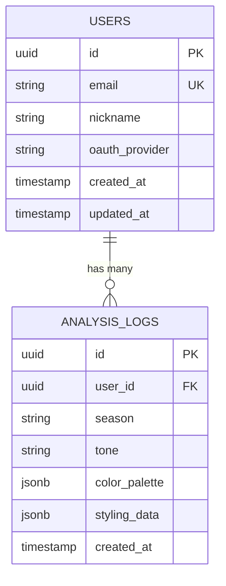

#  데이터베이스 명세서 (Database Specification)

본 프로젝트는 PostgreSQL을 사용하며, **프라이버시 중심(Privacy-First) 설계** 원칙에 따라 사용자의 안면 원본 이미지 경로(`image_url`)나 바이너리 데이터를 저장하는 컬럼을 데이터베이스 내에 일절 두지 않습니다. AI 분석을 통해 도출된 메타데이터(결과 텍스트 및 컬러 코드)만 안전하게 보관합니다.

---

##  1. ERD (Entity-Relationship Diagram)
GitHub Wiki에서 자체 렌더링을 지원하는 Mermaid.js 기반의 ERD입니다.



---

## 2. 테이블 상세 명세서 (Table Definitions)
**2.1. `users`테이블**
NextAuth.js를 통해 소셜 로그인(OAuth)한 사용자의 기본 식별 정보를 저장합니다.

| 컬럼명(Column) | 데이터 타입(Type) | 제약 조건(Constraints) | 설명 (Description) |
| :--- | :--- | :--- | :--- |
| `id` | `UUID` | Primary Key | 사용자 고유 식별자 (자동생성) |
| `email` | `VARCHAR(255)` | Unique, Not Null | 사용자 이메일 (로그인 식별용) |
| `oauth_provider` | VARCHAR(50) | Not Null | 가입 경로 (예: `google`, `kakao`, `naver`) |
| `created_at` | TIMESTAMP` | Default: `NOW()` | 계정 생성 일시 |
| `updated_at` | TIMESTAMP | Default: `NOW()` | 계정 정보 최근 수정 일시 |

---

**2.2. `analysis_logs` 테이블**
AI분석 엔진(ONNX)이 도출한 진단 이력과 추천 데이터를 저장합니다. 복잡하고 변경이 잦은 스타일링 추천 데이터는 PostgreSQL의 **JSONB**타입을 활용하여 스키마 마이그레이션 없이 유연하게 확장합니다.

| 컬럼명 (Column) | 데이터 타입 (Type) | 제약 조건 (Constraints) | 설명 (Description) |
| :--- | :--- | :--- | :--- |
| `id` | `UUID` | Primary Key | 진단 결과 고유 식별자 |
| `user_id` | `UUID` | Foreign Key, Not Null | users.id 참조 (진단 대상 사용자) |
| `season` | `VARCHAR(20)` | Not Null | 진단된 4계절 (예: `SPRING`, `SUMMER`) |
| `tone` | `VARCHAR(50)` | Not Null | 세부 톤 (예: `Warm Light`, `Mute`) |
| `color_palette` | `JSONB` | Not Null | 화면을 채울 메인/서브 컬러 Hex 코드 배열 (예: `["#FFB7B2", "#FFDAC1"]`) |
| `styling_data` | `JSONB` | Nullable | 헤어 염색 레시피, 메이크업 추천 등 복합 데이터 (UI 컴포넌트 렌더링에 직접 사용됨) |
| `created_at` | `TIMESTAMP` | Default: `NOW()` | 분석 완료 및 데이터 저장 일시 |

이 테이블에는 `image_path`, `raw_image` 등의 컬럼이 존재하지 않음. AI런타임이 이미지를 분석하고 JSON 결과를 반환하는 즉시, 메모리 상의 원본 이미지는 가비지 컬렉터(GC)에 의해 파기됨.

---

## 3. 주요 쿼리 예시 (Query Examples)
특정 사용자의 최근 진단 이력 및 헤어 염색 레시피 조회 (JSONB추출)
```SQL
SELECT 
    season, 
    tone, 
    styling_data->'hair_dye'->>'recipe' AS hair_recipe,
    created_at
FROM 
    analysis_logs
WHERE 
    user_id = '사용자의_UUID'
ORDER BY 
    created_at DESC
LIMIT 1;
```

전체 사용자 대상 가장 많이 나온 퍼스널 컬러 통계 (대시보드용)
```SQL
SELECT 
    season, 
    COUNT(*) as count
FROM 
    analysis_logs
GROUP BY 
    season
ORDER BY 
    count DESC;
```
