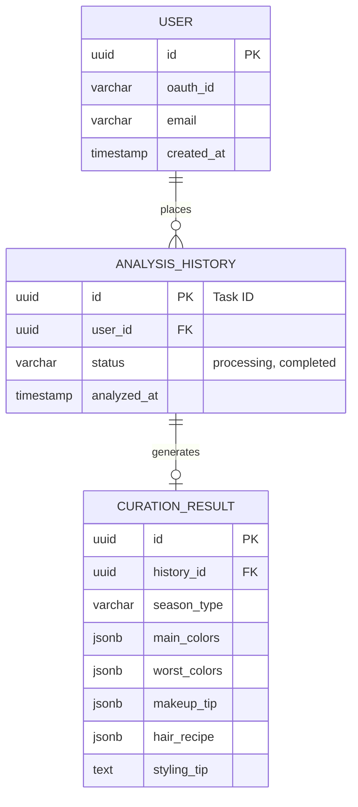

# 🗄️ Database ERD: Personal Color AI Analysis Application

본 문서는 퍼스널 컬러 진단 애플리케이션의 데이터베이스 구조를 설계하기 위해 7단계 ERD 작성 방법론에 따라 작성된 데이터 모델링 문서입니다.

## 가. 요구사항 수집 (Requirements Gathering)
**목표:** 사용자 식별, 진단 이력 관리, 맞춤형 큐레이션 결과 저장을 위한 관계형 데이터 구조 설계.

**핵심 비즈니스 규칙:**
* **Privacy-First:** 사용자의 안면 원본 이미지는 분석 직후 메모리에서 파기되며, DB에 절대 저장되지 않습니다.
* **소셜 로그인:** 자체 비밀번호 관리 없이 OAuth(NextAuth) 기반으로 사용자를 식별합니다.
* **이력 관리:** 사용자는 마이페이지에서 과거의 진단 결과(컬러, 메이크업, 헤어 레시피)를 누적해서 조회할 수 있어야 합니다.

## 나. 엔티티 식별 (Entity Identification)
요구사항을 바탕으로 다음 3가지 핵심 엔티티를 도출했습니다.

1.  **USER (사용자):** 소셜 로그인 인증을 통과한 사용자 정보.
2.  **ANALYSIS_HISTORY (진단 이력):** 사용자가 앱을 통해 AI 분석을 수행한 메타데이터 및 진행 상태.
3.  **CURATION_RESULT (큐레이션 결과):** AI 추론 완료 후 도출된 최종 퍼스널 컬러 및 맞춤형 스타일링 정보.

## 다. 속성 정의 (Attribute Definition)
각 엔티티의 세부 데이터 속성과 타입을 정의합니다. (PostgreSQL 기준)

### 1. USER
| Column Name | Data Type | Constraint | Description |
| :--- | :--- | :--- | :--- |
| `id` | UUID | PK | 사용자 고유 식별자 |
| `oauth_id` | VARCHAR | NOT NULL | OAuth 제공자측 고유 ID |
| `email` | VARCHAR | Nullable | 사용자 이메일 |
| `created_at` | TIMESTAMP | NOT NULL | 가입 일시 |

### 2. ANALYSIS_HISTORY
| Column Name | Data Type | Constraint | Description |
| :--- | :--- | :--- | :--- |
| `id` | UUID | PK | 진단 이력 고유 식별자 (API의 task_id와 동일) |
| `user_id` | UUID | FK | 요청한 사용자 ID |
| `status` | VARCHAR | NOT NULL | 분석 상태 (processing, completed, failed) |
| `analyzed_at` | TIMESTAMP | NOT NULL | 분석 완료 일시 |

### 3. CURATION_RESULT
| Column Name | Data Type | Constraint | Description |
| :--- | :--- | :--- | :--- |
| `id` | UUID | PK | 결과 고유 식별자 |
| `history_id` | UUID | FK | 연결된 진단 이력 ID |
| `season_type` | VARCHAR | NOT NULL | 최종 도출된 4계절 톤 (예: Summer Cool Mute) |
| `main_colors` | JSONB | NOT NULL | 화면을 채울 핵심 컬러 헥스(Hex) 코드 배열 |
| `worst_colors` | JSONB | NOT NULL | 피해야 할 컬러 헥스 코드 배열 |
| `makeup_tip` | JSONB | NOT NULL | 립, 섀도우, 블러셔 추천 텍스트 |
| `hair_recipe` | JSONB | NOT NULL | 컬러명, 믹스 비율, 탈색 권장 횟수 등 염색 레시피 |
| `styling_tip` | TEXT | NOT NULL | 종합 패션/스타일링 가이드 |

## 라. 관계 정의 (Relationship Definition)
엔티티 간의 비즈니스 논리적 상호작용을 정의합니다.

* **USER ↔ ANALYSIS_HISTORY (1 : N)**
    * 한 명의 사용자는 여러 번의 퍼스널 컬러 진단을 수행할 수 있습니다.
    * 하나의 진단 이력은 반드시 한 명의 사용자에게 속합니다.
* **ANALYSIS_HISTORY ↔ CURATION_RESULT (1 : 1)**
    * 성공적으로 완료된 하나의 진단 이력은 정확히 하나의 상세 큐레이션 결과를 가집니다.

## 마. ERD 작성 (ERD Visualization)
위에서 정의한 엔티티, 속성, 관계를 나타내는 시각적 ERD입니다. GitHub 환경에서 자동으로 다이어그램으로 렌더링됩니다.

