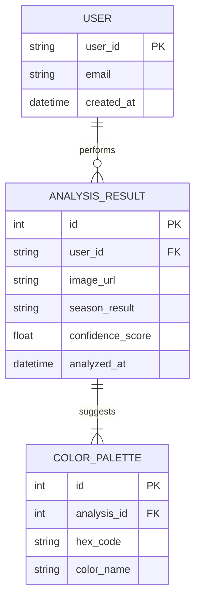

# team-07
Team 07 - MSP Architect Training 2026
# 🎨 AI Personal Color Analyzer & GitOps Infrastructure
> **v0.app 디자인과 Kaggle 데이터를 결합한 차세대 AI 서비스 및 GitOps 자동화 인프라 구축**

## 1. 프로젝트 개요 (Project Goals)
본 프로젝트는 최신 AI 웹 프레임워크와 데이터 플랫폼을 활용하여, **사용자 친화적인 AI 서비스를 안정적인 클라우드 네이티브 환경에 배포**하는 것을 목표로 함

* **Rapid UI Development (v0.app):** v0.app의 프롬프트 기반 UI 생성을 통해 고도로 정제된 React 기반 프론트엔드 구축 및 컨테이너화
* **Data-Driven AI (Kaggle):** Kaggle의 고품질 데이터셋과 사전 학습된 모델을 활용하여 분석 정확도를 확보하고, Kaggle API를 통한 데이터 파이프라인 구축
* **Zero-Touch Deployment (GitOps):** GitLab CI와 ArgoCD를 연계하여 코드 변경부터 인프라 반영까지 전 과정을 자동화하는 **Full-Automation** 실현
* **Scalable Architecture:** 트래픽 변화에 유연하게 대응할 수 있도록 Kubernetes 오케스트레이션 및 HPA(Autoscaling) 적용

---

## 2. 기술 스택 (Tech Stack)

| 분류 | 기술 도구 | 활용 목적 |
| :--- | :--- | :--- |
| **Frontend** | **v0.app**, React (Next.js) | 프롬프트 기반 UI 설계 및 고속 웹 개발 |
| **Backend** | **FastAPI** (Python) | 비동기 기반 AI 추론 API 서버 구축 |
| **AI / Data** | **Kaggle**, OpenCV, Dlib | 학습 데이터 확보 및 퍼스널 컬러 분석 알고리즘 |
| **Container** | **Docker** | 프론트/백엔드 환경 독립성 보장 및 이미지 최적화 |
| **Orchestration** | **Kubernetes** | 자원 관리, 셀프 힐링 및 무중단 배포 환경 |
| **CI / CD** | **GitLab CI**, **ArgoCD** | GitOps 기반의 지속적 통합 및 선언적 배포 |

---

## 3. 핵심 아키텍처 (Key Highlights)

1.  **UI-to-Container:** v0.app에서 생성된 코드를 Docker 이미지화하여 프론트엔드 Pod로 배포
2.  **Kaggle API Integration:** 컨테이너 빌드 또는 실행 시 Kaggle API를 통해 최신 모델/데이터 자동 로드
3.  **GitOps Pipeline:** * **App Repo:** 소스 코드 변경 시 GitLab CI를 통해 이미지 빌드 및 푸시
    * **Manifest Repo:** K8s 설정(YAML) 변경 시 ArgoCD가 클러스터 상태를 자동으로 동기화

---

### 4. 화면 구성 (Screen Composition)
v0.app을 통해 설계된 사용자 중심의 인터페이스입니다.
* **Main Home**: 서비스 소개 및 '진단 시작' 버튼
* **Analysis Page**: 실시간 카메라 연동(가이드라인 제공) 또는 이미지 업로드 영역
* **Result Page**: 분석된 퍼스널 컬러(사계절) 시각화 및 어울리는 컬러 팔레트 추천
* **History Page**: 이전 진단 기록 리스트 및 상세 보기

---

### 5. 핵심 API 명세 (API Specification)
FastAPI 기반의 비동기 통신 구조입니다.
| Method | Endpoint | Description | Payload |
| :--- | :--- | :--- | :--- |
| `POST` | `/api/v1/analyze` | 이미지 분석 요청 | `{ image: File }` |
| `GET` | `/api/v1/results/{id}` | 특정 진단 결과 조회 | - |
| `GET` | `/api/v1/history` | 사용자 진단 이력 전체 조회 | - |

---

### 6. 데이터 구조 (ERD - Mermaid)
사용자 정보와 진단 결과를 관리하는 논리적 구조입니다.

---

## 7. 2주 완성 로드맵 (Roadmap)
- [ ] **1주차: Build & Containerize**
    - [ ] v0.app UI 디자인 및 React 코드 추출
    - [ ] Kaggle API 연동 및 퍼스널 컬러 분석 백엔드(FastAPI) 개발
    - [ ] 프론트/백엔드 Dockerfile 작성 및 이미지 최적화
- [ ] **2주차: Deploy & Automate**
    - [ ] Kubernetes 매니페스트(Deployment, Service, Ingress) 작성
    - [ ] GitLab CI 파이프라인 구성 (Build -> Push)
    - [ ] ArgoCD 연동 및 무중단 배포 환경 최종 검증

---
## 8. 시작하기 (Getting Started)
(작업이 진행됨에 따라 로컬 실행 방법 등 추가 예정)
